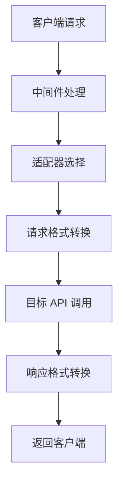
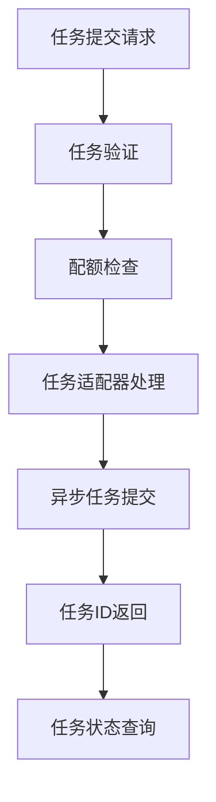

# Relay 模块文档

## 概述

Relay 模块是 New API 系统的核心请求转发组件，负责将客户端的 API 请求转发到不同的 AI 服务提供商。该模块实现了统一的接口适配器模式，支持多种 AI 服务提供商的 API 格式转换和请求处理。

## 模块架构

### 核心组件

```
relay/
├── relay_adaptor.go      # 适配器工厂和平台管理
├── relay_task.go         # 任务提交和获取逻辑
├── websocket.go          # WebSocket 连接处理
├── *_handler.go          # 各种请求类型处理器
└── channel/              # 渠道适配器实现
    ├── adapter.go        # 适配器接口定义
    ├── api_request.go    # API 请求通用逻辑
    └── [provider]/       # 各服务提供商实现
```

## 核心功能

### 1. 适配器工厂 (relay_adaptor.go)

#### 主要功能
- **多平台适配器管理**: 支持 30+ AI 服务提供商
- **任务平台适配**: 支持音频、视频、图像生成等任务类型
- **统一接口**: 通过工厂模式提供统一的适配器接口

#### 支持的服务提供商

```go
// 主要支持的 API 类型
const (
    APITypeOpenAI     = 1   // OpenAI GPT 系列
    APITypeAnthropic  = 2   // Claude 系列
    APITypeGemini     = 3   // Google Gemini
    APITypeBaidu      = 4   // 百度文心一言
    APITypeZhipu      = 5   // 智谱 AI
    APITypeAli        = 6   // 阿里通义千问
    // ... 更多提供商
)
```

#### 核心方法

```go
// 获取标准 API 适配器
func GetAdaptor(apiType int) channel.Adaptor

// 获取任务处理适配器  
func GetTaskAdaptor(platform constant.TaskPlatform) channel.TaskAdaptor

// 获取任务平台标识
func GetTaskPlatform(c *gin.Context) constant.TaskPlatform
```

### 2. 任务处理 (relay_task.go)

#### 任务提交流程

```go
func RelayTaskSubmit(c *gin.Context, info *relaycommon.RelayInfo) *dto.TaskError
```

**处理步骤**:
1. **初始化渠道元数据**: 设置请求上下文信息
2. **适配器选择**: 根据平台类型获取对应适配器
3. **请求验证**: 验证请求格式和参数
4. **配额检查**: 检查用户配额是否充足
5. **请求构建**: 构建目标 API 请求体
6. **请求执行**: 发送请求到目标服务
7. **响应处理**: 处理响应并记录消费
8. **任务记录**: 保存任务信息到数据库

#### 配额管理

```go
// 配额计算逻辑
groupRatio := ratio_setting.GetGroupRatio(info.UsingGroup)
userGroupRatio, hasUserGroupRatio := ratio_setting.GetGroupGroupRatio(info.UserGroup, info.UsingGroup)

if hasUserGroupRatio {
    ratio = modelPrice * userGroupRatio
} else {
    ratio = modelPrice * groupRatio
}

quota := int(ratio * common.QuotaPerUnit)
```

#### 任务获取功能

```go
// 任务获取路由映射
var fetchRespBuilders = map[int]func(c *gin.Context) (respBody []byte, taskResp *dto.TaskError){
    relayconstant.RelayModeSunoFetchByID:  sunoFetchByIDRespBodyBuilder,
    relayconstant.RelayModeSunoFetch:      sunoFetchRespBodyBuilder,
    relayconstant.RelayModeVideoFetchByID: videoFetchByIDRespBodyBuilder,
}
```

### 3. 渠道适配器接口 (channel/adapter.go)

#### 标准适配器接口

```go
type Adaptor interface {
    // 初始化适配器
    Init(info *relaycommon.RelayInfo)
    
    // 请求处理
    GetRequestURL(info *relaycommon.RelayInfo) (string, error)
    SetupRequestHeader(c *gin.Context, req *http.Header, info *relaycommon.RelayInfo) error
    
    // 格式转换
    ConvertOpenAIRequest(c *gin.Context, info *relaycommon.RelayInfo, request *dto.GeneralOpenAIRequest) (any, error)
    ConvertClaudeRequest(c *gin.Context, info *relaycommon.RelayInfo, request *dto.ClaudeRequest) (any, error)
    ConvertGeminiRequest(c *gin.Context, info *relaycommon.RelayInfo, request *dto.GeminiChatRequest) (any, error)
    
    // 专用请求类型
    ConvertEmbeddingRequest(c *gin.Context, info *relaycommon.RelayInfo, request dto.EmbeddingRequest) (any, error)
    ConvertAudioRequest(c *gin.Context, info *relaycommon.RelayInfo, request dto.AudioRequest) (io.Reader, error)
    ConvertImageRequest(c *gin.Context, info *relaycommon.RelayInfo, request dto.ImageRequest) (any, error)
    
    // 请求执行和响应处理
    DoRequest(c *gin.Context, info *relaycommon.RelayInfo, requestBody io.Reader) (any, error)
    DoResponse(c *gin.Context, resp *http.Response, info *relaycommon.RelayInfo) (usage any, err *types.NewAPIError)
    
    // 元数据
    GetModelList() []string
    GetChannelName() string
}
```

#### 任务适配器接口

```go
type TaskAdaptor interface {
    // 初始化和验证
    Init(info *relaycommon.RelayInfo)
    ValidateRequestAndSetAction(c *gin.Context, info *relaycommon.RelayInfo) *dto.TaskError
    
    // 请求构建
    BuildRequestURL(info *relaycommon.RelayInfo) (string, error)
    BuildRequestHeader(c *gin.Context, req *http.Request, info *relaycommon.RelayInfo) error
    BuildRequestBody(c *gin.Context, info *relaycommon.RelayInfo) (io.Reader, error)
    
    // 请求处理
    DoRequest(c *gin.Context, info *relaycommon.RelayInfo, requestBody io.Reader) (*http.Response, error)
    DoResponse(c *gin.Context, resp *http.Response, info *relaycommon.RelayInfo) (taskID string, taskData []byte, err *dto.TaskError)
    
    // 任务管理
    FetchTask(baseUrl, key string, body map[string]any) (*http.Response, error)
    ParseTaskResult(respBody []byte) (*relaycommon.TaskInfo, error)
    
    // 元数据
    GetModelList() []string
    GetChannelName() string
}
```

## 请求处理流程

### 1. 标准 API 请求流程



### 2. 任务类型请求流程



## 支持的请求类型

### 1. 文本生成
- **OpenAI 格式**: `/v1/chat/completions`, `/v1/completions`
- **Claude 格式**: `/v1/messages`
- **Gemini 格式**: `/v1beta/models/{model}:generateContent`

### 2. 嵌入向量
- **标准格式**: `/v1/embeddings`
- **引擎格式**: `/v1/engines/{model}/embeddings`

### 3. 音频处理
- **语音转文本**: `/v1/audio/transcriptions`
- **语音翻译**: `/v1/audio/translations`
- **文本转语音**: `/v1/audio/speech`

### 4. 图像生成
- **图像生成**: `/v1/images/generations`
- **图像编辑**: `/v1/images/edits`

### 5. 任务类型
- **Suno 音乐生成**: `/suno/submit/{action}`
- **Midjourney 图像**: `/mj/submit/{action}`
- **视频生成**: `/v1/video/generations`

## 错误处理

### 错误类型
- **配额不足**: `quota_not_enough`
- **渠道不可用**: `channel_not_available`
- **模型不支持**: `model_not_found`
- **请求格式错误**: `invalid_request`
- **任务处理失败**: `task_processing_failed`

### 错误响应格式

```json
{
    "error": {
        "code": "quota_not_enough",
        "message": "用户配额不足",
        "type": "insufficient_quota"
    }
}
```

## 配置说明

### 渠道配置
- **Base URL**: 目标 API 的基础 URL
- **API Key**: 认证密钥
- **模型映射**: 本地模型名到远程模型名的映射
- **参数覆盖**: 请求参数的自定义覆盖
- **头部覆盖**: HTTP 头部的自定义设置

### 任务配置
- **超时设置**: 任务提交和查询的超时时间
- **重试策略**: 失败任务的重试机制
- **状态轮询**: 任务状态的轮询间隔

## 性能优化

### 1. 连接池管理
- HTTP 客户端连接复用
- 连接超时和空闲超时配置
- 最大连接数限制

### 2. 缓存策略
- 渠道信息缓存
- 模型列表缓存
- 用户配额缓存

### 3. 异步处理
- 任务异步提交
- 响应流式处理
- WebSocket 长连接支持

## 扩展指南

### 添加新的服务提供商

1. **创建适配器实现**
```go
type NewProviderAdaptor struct {
    // 适配器字段
}

func (a *NewProviderAdaptor) Init(info *relaycommon.RelayInfo) {
    // 初始化逻辑
}

// 实现 Adaptor 接口的所有方法
```

2. **注册适配器**
```go
// 在 GetAdaptor 函数中添加新的 case
case constant.APITypeNewProvider:
    return &newprovider.Adaptor{}
```

3. **添加常量定义**
```go
const (
    APITypeNewProvider = 100  // 新的 API 类型
)
```

### 添加新的任务类型

1. **实现任务适配器**
```go
type NewTaskAdaptor struct {
    // 任务适配器字段
}

// 实现 TaskAdaptor 接口的所有方法
```

2. **注册任务适配器**
```go
// 在 GetTaskAdaptor 函数中添加新的 case
case constant.TaskPlatformNewTask:
    return &newtask.TaskAdaptor{}
```

## 监控和日志

### 关键指标
- **请求成功率**: 按渠道和模型统计
- **响应时间**: P50, P95, P99 延迟
- **配额消耗**: 用户和渠道配额使用情况
- **错误率**: 各类错误的发生频率

### 日志记录
- **请求日志**: 包含请求参数、响应时间、状态码
- **错误日志**: 详细的错误信息和堆栈跟踪
- **配额日志**: 配额消耗和计费记录
- **任务日志**: 任务提交、处理、完成状态

## 最佳实践

### 1. 适配器开发
- 遵循接口规范，确保所有方法正确实现
- 处理各种异常情况，提供友好的错误信息
- 支持流式响应，提高用户体验
- 实现正确的配额计算和消费记录

### 2. 性能优化
- 使用连接池减少连接开销
- 实现合理的超时和重试机制
- 缓存不变的数据，如模型列表
- 异步处理长时间运行的任务

### 3. 错误处理
- 区分临时错误和永久错误
- 提供详细的错误信息帮助调试
- 实现优雅的降级策略
- 记录足够的日志信息用于问题排查

---

*本文档描述了 Relay 模块的核心功能和使用方法。如需了解具体的实现细节，请参考源代码和相关的技术文档。*